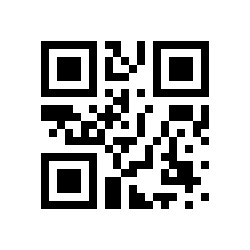

# QR Code REST Service

## About

A simple Spring REST service that will generate a QR Code that encodes the content you choose.
Any string passed as a URL parameter can be encoded as a QR code! [1]

For example, the "helloWorld" String can be encoded using the application endpoint.
http://localhost:8080/api/qrcode?contents=helloWorld

Pointing your smartphone camera at the QR code will display "helloWorld" to decode the QR code.

## Install and Run

- Install Maven
    - Download and install: https://maven.apache.org/install.html
- `mvn exec:java` will start the program.

## User Interaction
The REST framework is used for interacting with the application to generate QR codes.
- Generate a QR code
    - GET http://localhost:8080/api/qrcode?contents=helloWorld&correction=L&type=png&size=250
    - Parameters
      - `contents` - Required parameter. The string you want to encode in the QR code.
      - `correction` - Optional parameter. Default value is `L`. Correction is in `["L", "M", "Q", "H"]` and represents the error correction level for encoding the `contents` into the QR code.
        - Level L (Low): The QR code can withstand up to approximately 7% damage. 
        - Level M (Medium): The QR code can withstand up to approximately 15% damage. 
        - Level Q (Quartile): The QR code can withstand up to approximately 25% damage. 
        - Level H (High): The QR code can withstand up to approximately 30% damage.
      - `type` - Optional parameter. Default value is `png`. Must be from the options `["png", "jpeg", "gif"]`. This is the file format of the QR code generated.
      - `size` - Optional parameter. Default value is `250`. Must be `>=150` and `<=350`. This is the size of the QR code generated.

##  References

1. [QR Code Rest Service with Java Hyperskill project](https://hyperskill.org/projects/385)